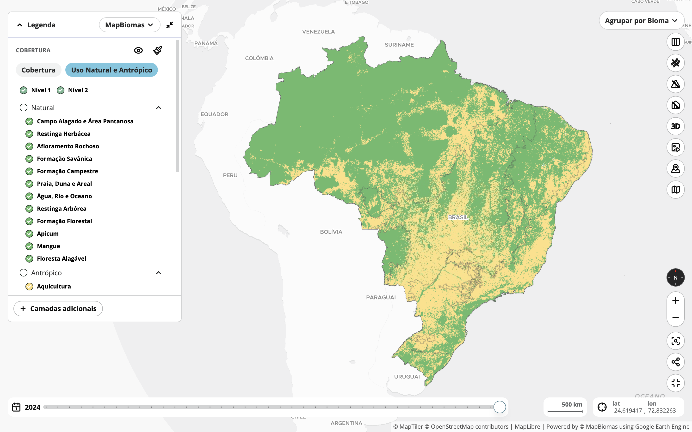
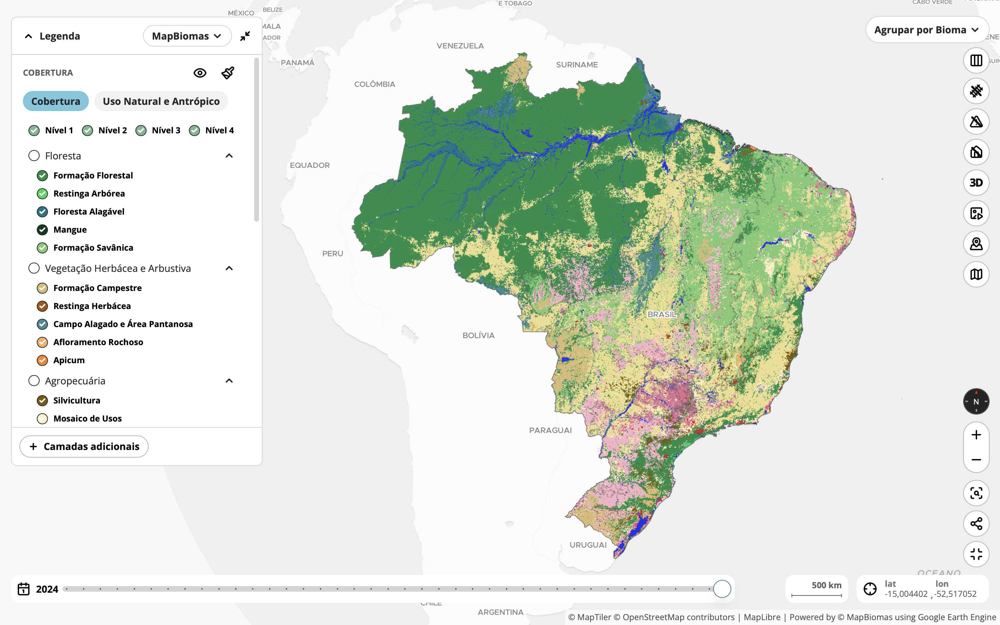
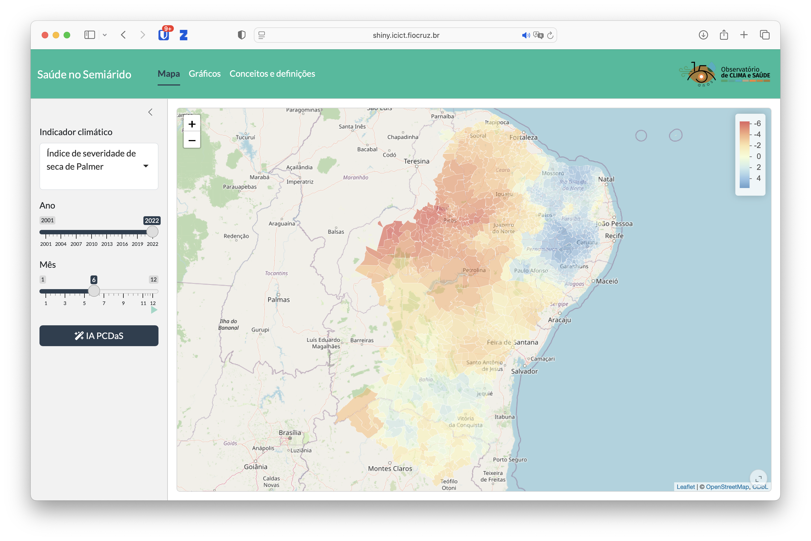
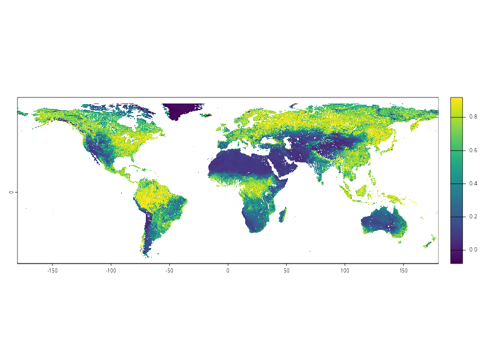

# Indicadores Ambientais

Indicadores ambientais desempenham papel central na análise da Saúde Pública ao possibilitarem a identificação, o monitoramento e a compreensão dos fatores ambientais que influenciam o bem-estar das populações. Variáveis como uso e cobertura do solo, condições de umidade e seca, dinâmica da vegetação e níveis de poluição do ar e da água permitem caracterizar exposições e contextos territoriais de risco. Quando integrados a dados de saúde, esses indicadores ampliam a capacidade de análise, favorecendo a identificação de padrões, a antecipação de agravos e o direcionamento de ações preventivas. Além disso, fornecem base empírica para a formulação de políticas públicas mais eficazes e territorialmente orientadas. Assim, o uso sistemático e integrado de indicadores ambientais fortalece a vigilância em saúde, contribui para a redução de desigualdades e apoia a tomada de decisão fundamentada em evidências científicas.

Este capítulo apresenta alguns dos principais indicadores ambientais de interesse para a Saúde Pública. Sempre que possível, são indicados conjuntos de dados já harmonizados para municípios brasileiros, disponíveis na página de [datasets](https://rfsaldanha.github.io/data.html).

::: callout-warning
Indicadores ambientais geralmente representam condições do território e devem ser interpretados como aproximações da exposição populacional. A média municipal de um poluente, de um índice de vegetação ou de uma classe de uso do solo não descreve, isoladamente, a exposição individual de cada pessoa. Sua interpretação deve considerar a escala espacial, o período de agregação, a mobilidade da população e a heterogeneidade interna do território.
:::

| Domínio | Indicadores apresentados | Tipo de exposição | Fonte harmonizada sugerida |
|---|---|---|---|
| Território e ambiente construído | Densidade demográfica, uso do solo, cobertura do solo | Contexto territorial e ambiente construído | IBGE, MapBiomas e repositórios municipais harmonizados |
| Seca | SPI, PDSI | Escassez hídrica e estresse ambiental | Estatísticas zonais de indicadores climáticos para municípios brasileiros |
| Vegetação | NDVI | Exposição a áreas verdes e vigor vegetativo | Médias de NDVI para municípios brasileiros |
| Poluição do ar | PM~2,5~, NO~2~, O~3~, CO, SO~2~ | Concentração de poluentes atmosféricos | Médias de poluentes atmosféricos para municípios brasileiros |

: Síntese dos domínios e fontes de dados ambientais apresentados no capítulo

## Território, uso do solo e ambiente construído

Indicadores sobre uso e ocupação do solo permitem determinar a quais condições ambientais as populações estão expostas, evidenciando questões como adensamento urbano, ocupação desordenada, vulnerabilidade a desastres e escassez de áreas verdes. Estes fatores têm grande influência na saúde humana, afetando a qualidade do ar e do solo, o conforto térmico e o bem-estar psicológico.

### Densidade demográfica

#### Conceituação {.unnumbered}

Relação entre o número de habitantes e a área geográfica, expressa geralmente em habitantes por quilômetro quadrado (hab/km²).

#### Interpretação {.unnumbered}

A densidade demográfica ou populacional está associada à demanda por serviços de saúde, infraestrutura, saneamento e transporte. Altas densidades podem favorecer a propagação de doenças transmissíveis, aumentar a poluição e reduzir a qualidade de vida, enquanto baixas densidades podem dificultar o acesso a serviços básicos.

#### Usos {.unnumbered}

Utilizado no planejamento urbano e regional, alocação de recursos públicos, análise de risco epidemiológico, vigilância em saúde e políticas de habitação.

#### Limitações {.unnumbered}

-   O indicador não considera características do território, como áreas não-habitáveis (corpos d'água e florestas e montanhas protegidas pela legislação ambiental).
-   Uma alta ou baixa densidade não está relacionada, necessariamente, a uma maior ou menor qualidade de vida.

#### Fonte de dados {.unnumbered}

Censos populacionais, estimativas populacionais e dados geográficos de instituições oficiais, como o IBGE (Brasil).

#### Método de cálculo {.unnumbered}

$$
\text{Densidade populacional} = 
\frac{\text{População total}}{\text{Área territorial}}
$$

#### Categorias sugeridas para análise {.unnumbered}

Unidade geográfica: Brasil, grandes regiões, estados, Distrito Federal e regiões metropolitanas, municípios.

### Uso do solo por categoria

{fig-align="center"}

#### Conceituação {.unnumbered}

Classificação e quantificação das diferentes formas de utilização da superfície terrestre por atividades humanas, como moradia, agricultura, indústria, comércio, áreas verdes, infraestrutura e áreas institucionais. Ele permite identificar como os espaços são organizados e utilizados dentro de uma área geográfica específica.

#### Interpretação {.unnumbered}

O uso do solo influencia diretamente as condições ambientais e sanitárias de uma região. Ocupações inadequadas podem resultar em exposição a riscos como contaminação por resíduos, poluição atmosférica, alagamentos e proliferação de vetores de doenças. O acesso a áreas verdes, serviços públicos e infraestrutura adequada, refletido no uso do solo, está associado a melhores condições de saúde física e mental.

#### Usos {.unnumbered}

-   Planejamento urbano e ordenamento territorial.
-   Avaliação de impactos ambientais.
-   Gestão de recursos naturais e infraestrutura.
-   Formulação de políticas públicas de saúde, habitação e mobilidade.
-   Monitoramento da expansão urbana e uso sustentável do território.

#### Limitações {.unnumbered}

-   Pode não refletir a qualidade do uso ou a intensidade da atividade (ex: área residencial subutilizada ou superlotada)
-   Classificações podem variar conforme a metodologia adotada.
-   Nem sempre identifica usos mistos ou informais do solo (como moradia em áreas industriais ou invasões).

#### Método de cálculo {.unnumbered}

O indicador de uso do solo pode ser expresso em termos percentuais ou absolutos da área ocupada por cada tipo de uso em relação à área total analisada. O cálculo é feito com base em classificação de imagens de satélite, por meio de técnicas de sensoriamento remoto e análise multiespectral.

$$
\text{Uso do solo} = \frac{\text{Área de uso específico}}{\text{Área total}} \times 100
$$

As principais categorias mensuradas são:

-   Uso residencial
-   Uso comercial
-   Uso industrial
-   Uso institucional
-   Uso agrícola ou rural
-   Uso de lazer e recreação
-   Áreas verdes ou vegetadas
-   Infraestrutura, como sistemas de transporte e saneamento
-   Corpos d'água
-   Uso indefinido, como lotes vagos ou em transição

#### Categorias sugeridas para análise {.unnumbered}

Unidade geográfica: Brasil, grandes regiões, estados, Distrito Federal e regiões metropolitanas, municípios.

#### Fonte de dados {.unnumbered}

-   Imagens de satélite
-   Cadastros urbanos
-   [MapBiomas](https://brasil.mapbiomas.org)
-   [INPE TerraClass](https://www.terraclass.gov.br)

O repositório abaixo disponibiliza uma série histórica dos percentuais de uso do solo dos municípios brasileiros.

[](https://doi.org/10.5281/zenodo.19285752)

Veja um exemplo prático de uso usando o R.

```{r}
#| message: false
#| code-fold: false
library(zendown)
library(arrow)
library(dplyr)
library(ggplot2)

zen_file(19285752, "uso_solo_mapbiomas.parquet") |>
  read_parquet() |>
  filter(cod_ibge == 2611606) |>
  ggplot(aes(x = as.numeric(ano), y = percentual)) +
  geom_line() +
  facet_wrap(~classe, scales = "free_y") +
  labs(
    title = "Uso do solo em Recife, PE",
    x = "Ano",
    y = "Percentual",
    caption = "Fonte: MapBiomas"
  ) +
  theme_bw()
```

### Cobertura do solo por categoria

{fig-align="center"}

#### Conceituação {.unnumbered}

Descrição da superfície terrestre com base nos elementos físicos e biológicos visíveis, como vegetação natural, corpos d’água, edificações, solo exposto e superfícies impermeáveis. Diferentemente do uso do solo, que está ligado à atividade humana, a cobertura do solo representa o que efetivamente recobre o terreno, independentemente de sua função.

::: callout-tip
A *cobertura do solo* descreve o que está presente sobre a superfície terrestre, enquanto o *uso do solo* explica como essa superfície é empregada ou manejada. Assim, uma mesma categoria de cobertura pode corresponder a diferentes tipos de uso. Por exemplo, uma área coberta por vegetação florestal pode estar destinada à conservação ambiental (uso conservacionista) ou à produção madeireira (uso econômico).
:::

#### Interpretação {.unnumbered}

A cobertura do solo influencia diretamente a qualidade ambiental e, consequentemente, a saúde da população. A presença de áreas verdes, por exemplo, está associada à melhora da qualidade do ar, redução de ilhas de calor, promoção da atividade física e bem-estar mental. Por outro lado, superfícies impermeáveis e solo exposto podem aumentar o risco de enchentes, poluição e propagação de vetores de doenças.

#### Usos {.unnumbered}

-   Monitoramento ambiental e urbano.
-   Planejamento e gestão territorial.
-   Avaliação de impactos ambientais.
-   Estudos sobre mudanças climáticas e eventos extremos.
-   Identificação de áreas de risco para intervenções em saúde pública.

#### Limitações {.unnumbered}

-   A distinção entre tipos de cobertura pode ser dificultada por limitações na resolução de imagens ou interferência de nuvens e sombras.
-   Pode não refletir a dinâmica sazonal da vegetação (ex: áreas agrícolas variam ao longo do ano).

#### Fonte de dados {.unnumbered}

-   Imagens de satélite
-   Cadastros urbanos
-   [MapBiomas](https://brasil.mapbiomas.org)
-   [INPE TerraClass](https://www.terraclass.gov.br)

O repositório de uso do solo citado na seção anterior também pode ser utilizado para análises de cobertura e uso do solo em municípios brasileiros.

#### Método de cálculo {.unnumbered}

O indicador pode ser expresso em termos percentuais ou absolutos da área ocupada por cada tipo de cobertura. O cálculo é feito com base em classificação de imagens de satélite, por meio de técnicas de sensoriamento remoto e análise multiespectral.

$$
\text{Cobertura do solo} = \frac{\text{Área de uma classe de cobertura}}{\text{Área total}} \times 100
$$

As principais classes mensuradas são:

-   Vegetação natural
-   Reflorestamento e silvicultura
-   Áreas urbanizadas
-   Solo exposto
-   Agricultura
-   Pastagem
-   Corpos d'água
-   Áreas úmidas e várzeas

#### Categorias sugeridas para análise {.unnumbered}

Unidade geográfica: Brasil, grandes regiões, estados, Distrito Federal e regiões metropolitanas, municípios.

## Seca

Indicadores sobre seca ajudam a antecipar, monitorar e mitigar uma série de impactos diretos e indiretos que a escassez de água pode provocar na população, com efeitos sobre a transmissão de doenças, a segurança alimentar, problemas respiratórios, doenças crônicas e a saúde mental.

### Índice de Precipitação Padronizado

Também chamado de *Standardized Precipitation Index* (SPI).

Fonte: @mckee_doesken_kleist_1993

#### Conceituação {.unnumbered}

Quantifica desvios da precipitação observada em relação à média histórica, em escalas temporais diversas (1, 3, 6, 12, até 48 meses).

#### Interpretação {.unnumbered}

O SPI permite identificar secas meteorológicas que podem ter efeitos diretos e indiretos sobre a saúde pública. O estresse hídrico pode aumentar a vulnerabilidade de populações já em risco social, dificultando o acesso a saneamento básico e serviços de saúde.

Ele é padronizado com média zero e desvio padrão um, permitindo comparações entre regiões e períodos distintos, independentemente do clima local.

#### Usos {.unnumbered}

-   Monitoramento de secas meteorológicas em sistemas de alerta precoce.
-   Planejamento de recursos hídricos e agrícolas.
-   Estudos de impacto climático em saúde, agricultura e segurança hídrica.
-   Classificação da severidade da seca (leve, moderada, severa e extrema).
-   Subsídio à elaboração de políticas públicas e ações de mitigação.

#### Limitações {.unnumbered}

-   Não considera a temperatura ou a evapotranspiração, o que pode superestimar a umidade disponível em regiões quentes.
-   Baseia-se exclusivamente em precipitação, podendo não refletir diretamente o estresse hídrico no solo ou vegetação.
-   Requer séries históricas longas e consistentes para maior confiabilidade.

#### Fonte de dados {.unnumbered}

-   Estações pluviométricas do INMET, ANA, CEMADEN e outras redes estaduais.
-   Produtos de reanálise climática (como ERA5) ou dados de satélite calibrados.
-   Bases globais como CHIRPS, GPCC, CRU e GPCP para escalas continentais ou globais.
-   [Médias de indicadores climáticos compilados para os municípios brasileiros](https://rfsaldanha.github.io/data-projects/brazil-climate-zonal-indicators.html).

#### Método de cálculo {.unnumbered}

1.  Coleta da série histórica de precipitação em uma escala de tempo (ex: acumulado de 3 meses).
2.  Ajuste da série a uma distribuição estatística (normalmente a distribuição gama).
3.  Transformação da distribuição para uma normal padrão, com média zero e desvio padrão igual a um.
4.  Cálculo do SPI como o valor $z$ correspondente à precipitação observada.

O SPI pode ser classificado em categorias:

| SPI          | Categoria de seca  |
|--------------|--------------------|
| \> +2,0      | Extremamente úmido |
| 0 a +1,0     | Condições normais  |
| -1,0 a -1,49 | Seca moderada      |
| -1,5 a -1,99 | Seca severa        |
| \< -2,0      | Seca extrema       |

: Classificação do SPI

#### Categorias sugeridas para análise {.unnumbered}

Unidade geográfica: Brasil, grandes regiões, estados, Distrito Federal e regiões metropolitanas, municípios.

### Índice de Severidade de Seca de Palmer

(PDSI – Palmer Drought Severity Index)

Fonte: @palmer_1965

{fig-align="center"}

#### Conceituação {.unnumbered}

Estima o balanço hídrico de uma região, combinando precipitação, evapotranspiração potencial ($ET_0$), capacidade de armazenamento de água no solo e recarga hídrica.

#### Interpretação {.unnumbered}

O PDSI apresenta uma série padronizada em que valores negativos indicam seca (–1 = seca moderada; –3 = seca severa; ≤ –4 = seca extrema) e valores positivos indicam condições úmidas.

#### Usos {.unnumbered}

-   Monitoramento operacional de secas em serviços meteorológicos e sistemas de alerta precoce.
-   Gestão de recursos hídricos (reservatórios, irrigação, hidroeletricidade).
-   Estudos epidemiológicos que relacionam eventos de seca a eventos de saúde.

#### Limitações {.unnumbered}

-   Utiliza coeficientes empíricos calibrados para regiões dos EUA (modelo original), podendo exigir recalibração para outros climas.
-   Sensível ao tipo de solo e profundidade radicular assumidos; erros nesses parâmetros afetam o resultado.
-   Requer longas séries contínuas de precipitação e temperatura; falhas comprometem a confiabilidade. Responde lentamente a eventos curtos (veranicos), pois foca no balanço de longo prazo.

#### Método de cálculo {.unnumbered}

1.  Conversão da temperatura média mensal em evapotranspiração potencial ($ET_0$) via equação de Thornthwaite ou Penman-Monteith simplificada.
2.  Cálculo do balanço hídrico mensal, estimando:
    -   Água disponível após $ET_0$
    -   Recarga e escoamento superficial
    -   Alteração do armazenamento de água no solo.
3.  Determinação das variáveis de deficiência/excesso hídrico ($d$, $D$, $Z$) segundo Palmer.
4.  Cálculo iterativo do índice PDSI que reflete anomalias acumuladas, com coeficientes $K$ de escalonamento sazonal.
5.  Classificação da severidade com base em limiares padronizados

::: callout-tip
Versões modernas incluem o Self-Calibrating PDSI (sc-PDSI), que ajusta automaticamente os coeficientes K à variabilidade climática local, melhorando a comparabilidade inter-regional.
:::

#### Categorias sugeridas para análise {.unnumbered}

Unidade geográfica: Brasil, grandes regiões, estados, Distrito Federal e regiões metropolitanas, municípios.

#### Fonte de dados {.unnumbered}

-   Séries pluviométricas e termométricas de redes nacionais (INMET, ANA, CEMADEN) ou dados globais (CRU, GPCC, CHIRPS).
-   Reanálises climáticas (ERA5, MERRA-2) para regiões com escassez de estações.
-   Bases de solos (FAO, SoilGrids) para estimar capacidade de campo e água disponível.
-   Projeto [TerraClimate](https://www.climatologylab.org/terraclimate.html).
-   [Projeto Saúde no Semiárido](https://shiny.icict.fiocruz.br/sentseca2/), Observatório de Clima e Saúde, LIS, ICICT.
-   [Médias de indicadores climáticos compilados para os municípios brasileiros](https://rfsaldanha.github.io/data-projects/brazil-climate-zonal-indicators.html).

O repositório abaixo disponibiliza uma série histórica da média do PDSI dos municípios brasileiros.

[](https://doi.org/10.5281/zenodo.19286356)

Veja um exemplo prático de uso usando o R.

```{r}
#| message: false
#| warning: false
#| code-fold: true
library(zendown)
library(arrow)
library(dplyr)
library(ggplot2)

zen_file(19286356, "pdsi_mean_mean.parquet") |>
  read_parquet() |>
  filter(code_muni == 2510808) |>
  ggplot(aes(x = as.Date(date), y = value)) +
  annotate(
    "rect",
    xmin = -Inf,
    xmax = Inf,
    ymin = -Inf,
    ymax = -4,
    alpha = .2,
    fill = "#7f0000"
  ) +
  annotate(
    "rect",
    xmin = -Inf,
    xmax = Inf,
    ymin = -4,
    ymax = -3,
    alpha = .2,
    fill = "#b30000"
  ) +
  annotate(
    "rect",
    xmin = -Inf,
    xmax = Inf,
    ymin = -3,
    ymax = -2,
    alpha = .2,
    fill = "#d95f0e"
  ) +
  annotate(
    "rect",
    xmin = -Inf,
    xmax = Inf,
    ymin = -2,
    ymax = -1,
    alpha = .2,
    fill = "#fdae6b"
  ) +
  annotate(
    "rect",
    xmin = -Inf,
    xmax = Inf,
    ymin = -1,
    ymax = 1,
    alpha = .2,
    fill = "#f0f0f0"
  ) +
  annotate(
    "rect",
    xmin = -Inf,
    xmax = Inf,
    ymin = 1,
    ymax = 2,
    alpha = .2,
    fill = "#bdd7e7"
  ) +
  annotate(
    "rect",
    xmin = -Inf,
    xmax = Inf,
    ymin = 2,
    ymax = 3,
    alpha = .2,
    fill = "#6baed6"
  ) +
  annotate(
    "rect",
    xmin = -Inf,
    xmax = Inf,
    ymin = 3,
    ymax = 4,
    alpha = .2,
    fill = "#3182bd"
  ) +
  annotate(
    "rect",
    xmin = -Inf,
    xmax = Inf,
    ymin = 4,
    ymax = Inf,
    alpha = .2,
    fill = "#08519c"
  ) +
  geom_line() +
  labs(
    title = "PDSI médio em Patos, PB",
    x = "Data",
    y = "PDSI",
    caption = "Fonte: TerraClimate"
  ) +
  theme_bw()
```

## Vegetação

### NDVI -- Normalized Difference Vegetation Index

Fonte: @Tucker1979

{fig-align="center"}

#### Conceituação {.unnumbered}

Trata-se de um índice espectral calculado a partir da reflectância no infravermelho-próximo (NIR) e na banda vermelha de sensores remotos orbitais ou aerotransportados. Varia de $–1$ (água/turbidez) a $+1$ (vegetação densa), representando o “verdor” ou a atividade fotossintética da cobertura vegetal.

#### Interpretação {.unnumbered}

Serve como proxy objetiva da exposição a áreas verdes, cujo aumento já foi relacionado a menores mortalidade por todas as causas e cardiovascular, menor incidência de doenças respiratórias, melhor saúde mental, redução do peso ao nascer e mitigação de ilhas de calor urbanas. Assim, o NDVI apoia avaliações de risco ambiental, vigilância epidemiológica e planejamento de cidades mais saudáveis.

#### Usos {.unnumbered}

-   Classificação de cenários de "alto" e "baixo" verde em estudos de coorte.
-   Modelagem de habitats de vetores (malária, dengue, leishmaniose).
-   Monitoramento de ondas de calor e planejamento de arborização
-   Avaliação de efetividade de intervenções urbanas (parques, corredores verdes).
-   Estudos de poluição atmosférica (vegetação como barreira física).

#### Limitações {.unnumbered}

-   Saturação em florestas muito densas.
-   Influência de solo exposto, neve ou umidade.
-   Sensibilidade a variações atmosféricas e ângulo solar.
-   Não distingue tipos de vegetação nem informa estrutura vertical.
-   Diferenças entre sensores exigem harmonização.

#### Método de cálculo {.unnumbered}

$$
\text{NDVI} = \frac{\rho_{\mathrm{NIR}} - \rho_{\mathrm{Red}}}{\rho_{\mathrm{NIR}} + \rho_{\mathrm{Red}}}
$$

#### Categorias sugeridas para análise {.unnumbered}

Unidade geográfica: Brasil, grandes regiões, estados, Distrito Federal e regiões metropolitanas, municípios.

#### Fonte de dados {.unnumbered}

-   Satélites Landsat, MODIS e Sentinel-2.
-   [Médias de NDVI para municípios brasileiros](https://rfsaldanha.github.io/data-projects/brazil_ndvi.html).

Os repositórios abaixo disponibilizam séries históricas da média do NDVI dos municípios brasileiros.

[](https://doi.org/10.5281/zenodo.17093199)

[](https://doi.org/10.5281/zenodo.18329383)

Veja um exemplo prático de uso usando o R.

```{r}
#| message: false
#| warning: false
#| code-fold: false
library(zendown)
library(arrow)
library(dplyr)
library(ggplot2)

open_dataset(c(
  zen_file(17093199, "ndvi_mean.parquet"),
  zen_file(18329383, "ndvi_mean.parquet")
)) |>
  filter(code_muni == 2614006) |>
  collect() |>
  ggplot(aes(x = date, y = value)) +
  geom_line() +
  labs(
    title = "NDVI médio em Serrita, PE",
    x = "Ano",
    y = "NDVI",
    caption = "Fonte: Copernicus"
  ) +
  theme_bw()
```

## Poluição do ar

### Material particulado fino ($\text{PM}_{2,5}$)

Fonte: @who2021aqg

#### Conceituação {.unnumbered}

Este indicador quantifica a presença de partículas sólidas e gotículas líquidas no ar com diâmetro aerodinâmico menor ou igual a 2,5 $\mu m$, incluindo sulfatos, nitratos, carbono, metais, poeira e outros elementos.

#### Interpretação {.unnumbered}

O material particulado deste diâmetro penetra profundamente nos alvéolos pulmonares, podendo alcançar a corrente sanguínea. Este indicador está associado a aumento de mortalidade por doenças cardiovasculares e respiratórias, câncer de pulmão, AVC, diabetes e desfechos adversos na gestação.

O indicador é lido como a concentração média de material particulado no ar por metro cúbico.

#### Usos {.unnumbered}

-   Vigilância da qualidade do ar
-   Estudos epidemiológicos
-   Avaliação de políticas públicas de controle de emissões
-   Sistemas de alerta precoce

#### Limitações {.unnumbered}

-   Alta variabilidade espacial: poucas estações podem subestimar ou superestimar exposições reais
-   Equipamentos de referência são caros e exigem manutenção
-   Sensores de baixo custo requerem calibração frequente e correção por temperatura/umidade
-   Impossibilidade de se determinar a fonte emissora do material (como tráfego, queima de biomassa, indústria, entre outros)
-   A composição química não é capturada pelo valor de massa

#### Método de cálculo {.unnumbered}

Quando calculado a partir de uma série temporal ou de uma superfície espacial, o indicador pode ser resumido por estatísticas como média, máximo, mínimo ou percentis no período e território de interesse. Em estudos ecológicos municipais, uma forma comum é calcular a média da concentração estimada no território:

$$
\text{PM}_{2,5} = \frac{1}{n}\sum_{i=1}^{n} C_i
$$

em que $C_i$ representa a concentração estimada em cada célula, ponto ou observação considerada, e $n$ representa o número de observações agregadas.

#### Categorias sugeridas para análise {.unnumbered}

Unidade geográfica: Brasil, grandes regiões, estados, Distrito Federal e regiões metropolitanas, municípios.

#### Fonte de dados {.unnumbered}

Este indicador pode ser calculado diretamente a partir de sensores ou estimado por sensoriamento remoto e reanálises atmosféricas.

O conjunto de dados abaixo disponibiliza séries históricas de poluentes atmosféricos para municípios brasileiros, calculadas por estatística zonal a partir do Copernicus Atmosphere Monitoring Service (CAMS).

-   [Médias de poluentes atmosféricos para municípios brasileiros](https://rfsaldanha.github.io/data-projects/brazil_air_pollutants.html).

[](https://doi.org/10.5281/zenodo.16374139)

Veja um exemplo prático de uso usando o R.

```{r}
#| message: false
#| warning: false
#| code-fold: false
library(zendown)
library(arrow)
library(dplyr)
library(ggplot2)

zen_file(16374139, "pm25_max_mean.parquet") |>
  read_parquet() |>
  filter(code_muni == 5103403) |>
  ggplot(aes(x = date, y = value)) +
  geom_line() +
  labs(
    title = "Concentração máxima média de PM2.5 em Cuiabá, MT",
    x = "Data",
    y = "µg/m³",
    caption = "Fonte: Copernicus/CAMS"
  ) +
  theme_bw()
```

### Dióxido de nitrogênio ($\text{NO}_{2}$)

Fonte: @who2021aqg

#### Conceituação {.unnumbered}

O dióxido de nitrogênio é um poluente atmosférico gasoso produzido principalmente por processos de combustão em veículos, indústrias, termelétricas e queimadas. Em áreas urbanas, costuma ser utilizado como marcador da poluição relacionada ao tráfego e à queima de combustíveis fósseis.

#### Interpretação {.unnumbered}

Concentrações mais elevadas indicam maior presença de emissões por combustão e podem estar associadas a irritação das vias aéreas, piora de doenças respiratórias, exacerbação de asma e aumento de atendimentos e internações por causas respiratórias.

#### Usos {.unnumbered}

-   Monitoramento da poluição relacionada ao tráfego.
-   Estudos sobre doenças respiratórias em áreas urbanas.
-   Avaliação de políticas de mobilidade e controle de emissões.

#### Limitações {.unnumbered}

-   Forte variação espacial em pequenas distâncias, especialmente perto de vias de grande circulação.
-   Pode atuar como marcador de uma mistura de poluentes, dificultando a atribuição causal isolada.
-   Estimativas por reanálise ou sensoriamento remoto podem suavizar gradientes intraurbanos.

#### Método de cálculo {.unnumbered}

O indicador pode ser agregado por média, máximo, mínimo ou percentis da concentração no território e período de interesse:

$$
\text{NO}_{2} = \frac{1}{n}\sum_{i=1}^{n} C_i
$$

#### Categorias sugeridas para análise {.unnumbered}

Unidade geográfica: Brasil, grandes regiões, estados, Distrito Federal e regiões metropolitanas, municípios.

#### Fonte de dados {.unnumbered}

-   Redes de monitoramento da qualidade do ar.
-   Reanálises atmosféricas e produtos de sensoriamento remoto.
-   [Médias de poluentes atmosféricos para municípios brasileiros](https://rfsaldanha.github.io/data-projects/brazil_air_pollutants.html).

### Ozônio troposférico ($\text{O}_{3}$)

Fonte: @who2021aqg

#### Conceituação {.unnumbered}

O ozônio troposférico é um poluente secundário formado por reações fotoquímicas entre óxidos de nitrogênio, compostos orgânicos voláteis e radiação solar. Diferentemente do ozônio estratosférico, que protege contra radiação ultravioleta, o ozônio próximo à superfície pode ser nocivo à saúde.

#### Interpretação {.unnumbered}

Valores mais elevados indicam maior potencial de exposição a poluição fotoquímica. O ozônio está associado a irritação ocular e respiratória, redução da função pulmonar, agravamento de asma e aumento de morbimortalidade respiratória, especialmente em dias quentes e ensolarados.

#### Usos {.unnumbered}

-   Vigilância da qualidade do ar em períodos quentes.
-   Estudos de efeitos respiratórios de curto prazo.
-   Avaliação de episódios de poluição fotoquímica.

#### Limitações {.unnumbered}

-   A formação do ozônio depende de processos atmosféricos complexos e não corresponde diretamente à emissão local.
-   Pode apresentar máximos em áreas afastadas das fontes primárias de emissão.
-   A interpretação deve considerar temperatura, radiação solar, vento e outros poluentes precursores.

#### Método de cálculo {.unnumbered}

O indicador pode ser resumido por estatísticas temporais ou espaciais, como média diária, média móvel ou máximo no período analisado:

$$
\text{O}_{3} = \frac{1}{n}\sum_{i=1}^{n} C_i
$$

#### Categorias sugeridas para análise {.unnumbered}

Unidade geográfica: Brasil, grandes regiões, estados, Distrito Federal e regiões metropolitanas, municípios.

#### Fonte de dados {.unnumbered}

-   Redes de monitoramento da qualidade do ar.
-   Reanálises atmosféricas e produtos de sensoriamento remoto.
-   [Médias de poluentes atmosféricos para municípios brasileiros](https://rfsaldanha.github.io/data-projects/brazil_air_pollutants.html).

### Monóxido de carbono (CO)

Fonte: @who2021aqg

#### Conceituação {.unnumbered}

O monóxido de carbono é um gás produzido pela combustão incompleta de combustíveis. Suas fontes incluem veículos automotores, queimadas, processos industriais e fontes domésticas de combustão em ambientes mal ventilados.

#### Interpretação {.unnumbered}

Concentrações elevadas indicam maior exposição a combustão incompleta. O CO se liga à hemoglobina, reduzindo a capacidade de transporte de oxigênio no sangue, e pode causar efeitos cardiovasculares, neurológicos e, em exposições intensas, intoxicação aguda.

#### Usos {.unnumbered}

-   Monitoramento de emissões por combustão.
-   Estudos de exposição a queimadas e poluição urbana.
-   Apoio a sistemas de alerta em episódios de fumaça e incêndios.

#### Limitações {.unnumbered}

-   Exposições em ambientes internos podem ser muito diferentes das concentrações ambientais externas.
-   Médias territoriais podem ocultar situações de risco localizadas.
-   A interpretação deve considerar fontes móveis, queimadas e ventilação atmosférica.

#### Método de cálculo {.unnumbered}

O indicador pode ser calculado como média ou outra estatística da concentração observada ou estimada no período:

$$
\text{CO} = \frac{1}{n}\sum_{i=1}^{n} C_i
$$

#### Categorias sugeridas para análise {.unnumbered}

Unidade geográfica: Brasil, grandes regiões, estados, Distrito Federal e regiões metropolitanas, municípios.

#### Fonte de dados {.unnumbered}

-   Redes de monitoramento da qualidade do ar.
-   Reanálises atmosféricas e produtos de sensoriamento remoto.
-   [Médias de poluentes atmosféricos para municípios brasileiros](https://rfsaldanha.github.io/data-projects/brazil_air_pollutants.html).

### Dióxido de enxofre ($\text{SO}_{2}$)

Fonte: @who2021aqg

#### Conceituação {.unnumbered}

O dióxido de enxofre é um gás produzido principalmente pela queima de combustíveis contendo enxofre e por algumas atividades industriais. Também pode estar associado a emissões de termelétricas, refinarias, processos metalúrgicos e fontes vulcânicas em alguns contextos.

#### Interpretação {.unnumbered}

Concentrações elevadas indicam maior presença de emissões sulfuradas e podem causar irritação respiratória, broncoconstrição e agravamento de doenças respiratórias, especialmente em pessoas com asma, crianças e idosos.

#### Usos {.unnumbered}

-   Monitoramento de áreas industriais e fontes estacionárias.
-   Estudos de efeitos respiratórios associados à poluição atmosférica.
-   Avaliação de políticas de controle de combustíveis e emissões industriais.

#### Limitações {.unnumbered}

-   A concentração pode ser muito localizada perto de fontes específicas.
-   Nem sempre é bem representada por médias municipais em áreas com fontes pontuais.
-   Pode se transformar na atmosfera e contribuir para a formação de material particulado secundário.

#### Método de cálculo {.unnumbered}

O indicador pode ser calculado como média, máximo ou percentil da concentração no território e período de interesse:

$$
\text{SO}_{2} = \frac{1}{n}\sum_{i=1}^{n} C_i
$$

#### Categorias sugeridas para análise {.unnumbered}

Unidade geográfica: Brasil, grandes regiões, estados, Distrito Federal e regiões metropolitanas, municípios.

#### Fonte de dados {.unnumbered}

-   Redes de monitoramento da qualidade do ar.
-   Reanálises atmosféricas e produtos de sensoriamento remoto.
-   [Médias de poluentes atmosféricos para municípios brasileiros](https://rfsaldanha.github.io/data-projects/brazil_air_pollutants.html).
