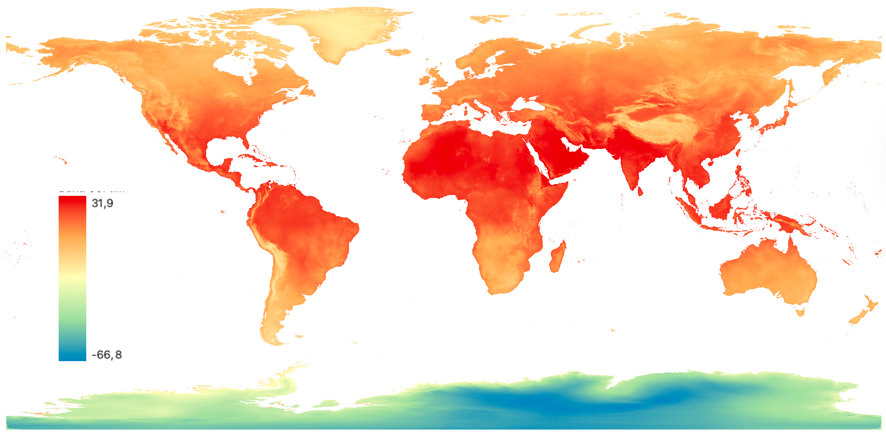
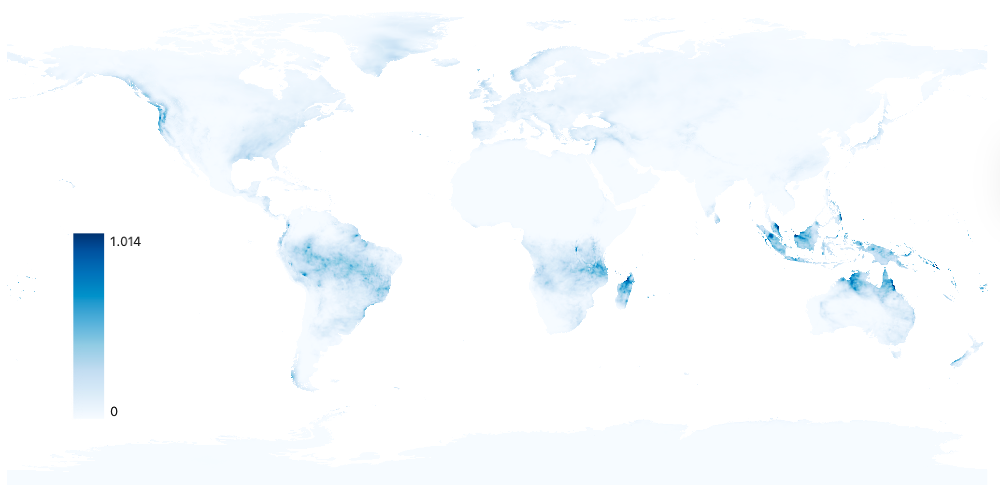

# Indicadores Climáticos

Indicadores climáticos são de grande importância para o estudo e contextualização de um conjunto de doenças cuja incidência e mecanismos de transmissão são afetados por fenômenos atmosféricos e climáticos. Este conjunto de doenças pode ser denominado como "Doenças Sensíveis ao Clima".

::: callout-tip
Usa-se o termo "tempo" para descrever as condições meteorológicas atuais ou de um passado ou futuro de curto prazo, dos próximos dias ou semanas. Já o termo "clima" é empregado para se descrever as condições meteorológicas observadas ou previstas para longo períodos, em geral, acima de 30 anos.
:::

A relação de entre clima e saúde pode se dar de modo direto ou indireto, a depender dos mecanismos do processo saúde-doença relevantes. A relação direta entre clima e saúde se dá quando o aspecto climático afeta diretamente o organismo e a saúde humana. Por exemplo, ondas de calor estressam fisicamente o mentalmente o corpo humano, podendo desencadear doenças respiratórias, cardíacas e até mesmo mentais. Outro exemplo de relação direta entre clima e saúde são eventos extremos, como chuvas torrenciais, alagamentos, deslizamentos de terra e secas, que afetam diretamente a saúde humana.

Já a relação indireta entre clima e saúde se dá por mecanismos intermediários, como a propagação de vetores. Por exemplo, condições meteorológicas específicas podem favorecer a proliferação de vetores de doenças, como mosquitos e ratos. Este aumento da população vetorial, por sua vez, pode levar a um aumento da circulação de vírus e bactérias, desencadeando por fim um aumento da incidência de doenças infecciosas. Este é o caso, por exemplo, de arboviroses como Dengue, Zika e Chikungunya.

::: callout-tip
A relação entre variáveis climáticas e a incidência de doenças tem uma defasagem temporal: as condições climáticas do *passado* são responsáveis por afetar a incidência de doenças no *futuro*. Isto tem relação com a dinâmica de cada vetor, incluindo os tempos necessários para o desenvolvimento do vetor, tempo de incubação e transmissão.
:::

O estudo de doenças sensíveis ao clima pode ser realizado observando indicadores nominais de variáveis climáticas, tão como com indicadores de eventos climáticos, como visto a seguir.

## Indicadores nominais

Indicadores climáticos nominais são constituídos pela observação direta do fenômeno atmosférico/climático em questão.

### Temperatura do ar

{fig-align="center"}

#### Conceituação {.unnumbered}

A temperatura diz respeito ao grau de agitação das moléculas no ar, onde um grau maior de agitação conduz a uma maior temperatura e um grau menor de agitação a uma menor temperatura. Desta forma, a temperatura é uma medida escalar arbitrária.

A temperatura do ar pode ser expressada em diversas unidades, como Kelvin, Graus Célsius e Fahrenheit. A temperatura de 0 Kelvin equivale teoricamente a um estado de nenhuma agitação das moléculas do ar. Já a temperatura de 272,15 Kelvin equivale a 0 graus célsius ou 32 fahrenheit.

A temperatura do ar pode ser medida através de instrumentos analógicos como o termômetro de mercúrio, instrumentos digitais com sensores específicos ou inferida à partir de sensores à bordo de satélites meteorológicos.

A medição da temperatura por instrumentos, sejam analógicos ou digitais, geralmente é feita em "Estações meteorológicas", que agrupam um certo número de instrumentos e sensores. Em geral, os instrumentos de mensuração da temperatura ficam armazenados em um tipo de armário, denominado "Abrigo de Stervenson". A construção desse "abrigo" é padronizada internacionalmente, possibilitando a obtenção da temperatura do ar na sombra de forma padronizada.

::: callout-tip
A localização de um termômetro ou sensor de temperatura afeta diretamente as observações. Estes instrumentos, quando expostos diretamente ao sol e localizados próximos à superfícies refletivas como telhados de zinco/metal, ou próximos a materiais de alta absorvição energética como concreto e asfalto, tendem a apresentar valores significativamente mais altos do que instrumentos localizados à sombra do sol e distantes destas superfícies e materiais.
:::

#### Interpretação {.unnumbered}

A interpretação de indicadores climáticos nominais deve ser feita com cautela posto que eles exprimem simplesmente o fenômeno meteorológico em questão em uma unidade direta. Por exemplo, a temperatura de 35 graus pode ser compreendida como uma temperatura muito alta por populações que vivem em zonas temperadas ou frias, ou como uma temperatura típica para populações que habitam zonas tropicais.

#### Usos {.unnumbered}

Estudos de saúde em geral observam a temperatura máxima e a temperatura mínima observadas durante um período de tempo (um dia, por exemplo). Estas duas temperaturas em conjunto exprimem bem a *amplitude térmica*, que é a diferença entre a temperatura máxima e mínima.

Alguns estudos mais específicos também fracionam o dia entre períodos diurnos e noturnos, com medidas de temperatura máxima e mínima observadas para cada um desses períodos.

::: callout-tip
A temperatura máxima observada em um dia costuma ocorrer no período da tarde, por volta das 15h no Brasil. Neste horário, apesar da incidência solar já estar levemente reduzida, os materiais como solo, concreto e asfalto já absorveram o máximo de energia solar possível e passam a emitir de volta esta energia acumulada para a atmosfera.

Já a temperatura mínima costuma ser observada por volta das 6h, logo antes do amanhecer. Este é o momento em que a superfície terrestre permaneceu a maior parte do tempo sem incidência solar desde o pôr-do-sol, já tendo perdido toda a energia solar acumulada.
:::

#### Limitações {.unnumbered}

A temperatura média, apesar de usada em alguns estudos, pode ser uma medida enganosa, principalmente em regiões com maiores amplitudes térmicas. Por exemplo, uma temperatura média de 25 graus célsius pode aparentar uma situação térmica aprazível, mas pode esconder variações importantes da temperatura durante o período observado.

#### Fontes de dados {.unnumbered}

Dados de temperatura podem ser obtidos por organismos meteorológicos oficiais como o Instituto Nacional de Meteorologia (INMET) e o Instituto de Pesquisas Espaciais (INPE), tão como em organizações privadas como Climatempo e Metsul.

-   [Projeto TerraClimate](https://www.climatologylab.org/terraclimate.html).
-   [Médias de indicadores climáticos compilados para os municípios brasileiros](https://rfsaldanha.github.io/data-projects/brazil-climate-zonal-indicators.html).

O repositório abaixo disponibiliza uma série histórica de variáveis climáticas dos municípios brasileiros.

[](https://doi.org/10.5281/zenodo.19285752)

Veja um exemplo prático de uso usando o R.

```{r}
#| message: false
#| warning: false
#| code-fold: false
library(zendown)
library(arrow)
library(dplyr)
library(ggplot2)

zen_file(19286356, "tmax_mean_mean.parquet") |>
  read_parquet() |>
  filter(code_muni == 3304557) |>
  ggplot(aes(x = as.Date(date), y = value)) +
  geom_line() +
  geom_smooth() +
  labs(
    title = "Temperatura máxima média mensal no Rio de Janeiro, RJ",
    x = "Data",
    y = "°C",
    caption = "Fonte: TerraClimate"
  ) +
  theme_bw()
```

### Precipitação

{fig-align="center"}

#### Conceituação {.unnumbered}

A precipitação é uma medida do volume de partículas de água que se precipitam da atmosfera e atingem a superfície terrestre. Desta forma, a precipitação não diz respeito unicamente da chuva, mas também a outras formas de precipitação de água, como granizo e neve.

Em geral, a precipitação é medida por um instrumento analógico denominado "pluviômetro", por sensores digitais, ou inferida à partir de sensores em satélites meteorológicos.

#### Interpretação {.unnumbered}

Por convenção, a precipitação observada representa a quantidade de partículas de água precipitada em um metro quadrado de superfície, geralmente expressa em milímetros.

::: callout-warning
Apesar de ser uma medida de volume, a precipitação é expressa em milímetros (mm) para guardar correspondência direta com o valor observado na régua de um pluviômetro.
:::

A precipitação é um indicador de volume acumulado por um período de tempo, podendo ser por hora, dia ou mês, geralmente. Desta forma, é necessário saber o tempo de acumulação para a correta interpretação do valor. Por exemplo, o valor de 110mm de precipitação pode ser relativamente elevado para um dia, mas relativamente baixo para um mês.

#### Usos {.unnumbered}

Estudos de clima e saúde usam a precipitação como indicador principalmente quando o desenvolvimento de um vetor necessita da oferta de água, como mosquitos.

#### Limitações {.unnumbered}

Chuvas são fenômenos meteorológicos que podem ser bem localizados, podendo ocorrer em um bairro e não ocorrer em um outro bairro vizinho. Desta forma, deve-se lembrar que a medida de precipitação observada por um sensor corresponde apenas a área de um metro quadrado ao seu redor.

#### Fontes de dados {.unnumbered}

Dados de precipitação podem ser obtidos por organismos meteorológicos oficiais como o Instituto Nacional de Meteorologia (INMET) e o Instituto de Pesquisas Espaciais (INPE), tão como em organizações privadas como Climatempo e Metsul.

-   [Projeto TerraClimate](https://www.climatologylab.org/terraclimate.html).
-   [Médias de indicadores climáticos compilados para os municípios brasileiros](https://rfsaldanha.github.io/data-projects/brazil-climate-zonal-indicators.html).

O repositório abaixo disponibiliza uma série histórica de variáveis climáticas dos municípios brasileiros.

[](https://doi.org/10.5281/zenodo.19285752)

Veja um exemplo prático de uso usando o R.

```{r}
#| message: false
#| warning: false
#| code-fold: false
library(zendown)
library(arrow)
library(dplyr)
library(ggplot2)

zen_file(19286356, "pet_mean_mean.parquet") |>
  read_parquet() |>
  filter(code_muni == 1302603) |>
  ggplot(aes(x = as.Date(date), y = value)) +
  geom_line() +
  geom_smooth() +
  labs(
    title = "Precipitação média mensal em Manaus, AM",
    x = "Data",
    y = "mm",
    caption = "Fonte: TerraClimate"
  ) +
  theme_bw()
```

### Umidade relativa do ar

#### Conceituação {.unnumbered}

A umidade relativa do ar é um indicador do grau de saturação de quantidade de água presente no ar.

#### Interpretação {.unnumbered}

Por ser um grau de saturação, a umidade relativa do ar é uma medida expressa em percentual: 100% de umidade relativa do ar significa que uma unidade de ar não consegue absorver mais água, estando completamente saturado. Esta capacidade de saturação do ar varia conforme a temperatura e pressão, por isso se diz que a umidade do ar é relativa.

A Organização Mundial da Saúde (OMS) apresenta níveis de referência para a umidade do ar relacionados a saúde humana.

#### Usos {.unnumbered}

A umidade do ar é utilizada em análises de clima e saúde quando a dinâmica vetorial é afetada por esse indicador: alguns vetores não são ativos ou são comprometidos em baixas ou altos níveis de umidade do ar.

#### Limitações {.unnumbered}

A comparação da umidade relativa do ar entre regiões deve ser feita considerando também os indicadores de temperatura e pressão.

#### Fontes de dados {.unnumbered}

Dados de sensação térmica podem ser obtidos por organismos meteorológicos oficiais como o Instituto Nacional de Meteorologia (INMET) e o Instituto de Pesquisas Espaciais (INPE), tão como em organizações privadas como Climatempo e Metsul.

-   [Projeto TerraClimate](https://www.climatologylab.org/terraclimate.html).
-   [Médias de indicadores climáticos compilados para os municípios brasileiros](https://rfsaldanha.github.io/data-projects/brazil-climate-zonal-indicators.html).

### Velocidade do vento

#### Conceituação {.unnumbered}

Expressa a intensidade do deslocamento horizontal do ar em um determinado local e período. Em estudos ambientais e de saúde, pode ser representado por medidas diárias, mensais ou anuais, como média, máximo, mínimo ou outros resumos estatísticos da velocidade observada. Sua unidade de medida é geralmente metros por segundo (m/s) ou quilômetros por hora (km/h). Trata-se de uma variável meteorológica fundamental para caracterizar a dinâmica atmosférica e as condições ambientais de um território.

#### Interpretação {.unnumbered}

Valores mais elevados indicam maior intensidade do vento, enquanto valores mais baixos sugerem condições de ar mais estagnado. A interpretação do indicador depende do contexto de análise. Ventos fracos podem favorecer o acúmulo de poluentes atmosféricos e fumaça, reduzindo a dispersão de contaminantes. Já ventos mais intensos podem aumentar a ventilação e a dispersão de poluentes, mas também podem transportar poeira, partículas, aerossóis, fumaça e alérgenos, além de influenciar o conforto térmico e a sensação térmica da população.

#### Usos {.unnumbered}

Esse indicador pode ser utilizado no monitoramento de condições meteorológicas e ambientais, em estudos de qualidade do ar, na análise da dispersão de poluentes e fumaça, na caracterização de contextos de desconforto térmico e em investigações sobre a relação entre variáveis ambientais e desfechos em saúde. Também pode apoiar sistemas de alerta, vigilância em saúde ambiental, modelagem atmosférica, planejamento territorial e avaliação de riscos relacionados a eventos extremos, queimadas e poluição do ar.

#### Limitações {.unnumbered}

A velocidade do vento, quando analisada isoladamente, não descreve completamente a dinâmica atmosférica, pois seus efeitos dependem também da direção do vento, da estabilidade atmosférica, da temperatura, da umidade, do relevo e do uso do solo. Sua interpretação pode variar entre diferentes contextos territoriais, como áreas urbanas, costeiras, rurais ou florestais. Além disso, os valores observados podem ser influenciados pela localização e altura dos instrumentos de medição, bem como pela resolução espacial e temporal dos dados utilizados.

#### Fontes de dados {.unnumbered}

O indicador pode ser calculado a partir de dados diários de velocidade do vento em estações meteorológicas, reanálises climáticas ou produtos em *grid*. Entre as fontes possíveis estão bases observacionais nacionais, como as estações do INMET, e produtos climáticos de reanálise, como o *ERA5-Land*.

### Sensação térmica

#### Conceituação {.unnumbered}

Representa a percepção térmica experimentada pelo corpo humano a partir da combinação entre a temperatura do ar e outras variáveis ambientais que influenciam as trocas de calor, como umidade relativa, velocidade do vento e, em alguns casos, radiação solar. Diferentemente da temperatura do ar isolada, a sensação térmica busca expressar de forma mais realista o conforto ou desconforto térmico ao qual a população está exposta. Sua estimativa pode ser feita por diferentes índices e fórmulas, cuja escolha depende do contexto climático e do objetivo da análise.

#### Interpretação {.unnumbered}

Valores mais elevados indicam condições de maior calor percebido, geralmente associadas a maior desconforto térmico e maior risco de estresse por calor, especialmente quando há alta umidade e baixa ventilação. Valores mais baixos indicam frio percebido mais intenso, frequentemente agravado por ventos fortes. Assim, a sensação térmica permite interpretar de forma mais próxima da experiência humana os efeitos combinados das condições atmosféricas, sendo útil para identificar situações de risco à saúde relacionadas ao calor ou ao frio.

#### Usos {.unnumbered}

Esse indicador pode ser utilizado para monitorar condições de conforto e desconforto térmico, subsidiar sistemas de alerta para eventos extremos, apoiar ações de vigilância em saúde ambiental e orientar estudos sobre os efeitos do calor e do frio na morbimortalidade. Também pode ser empregado em análises urbanas e territoriais, em avaliações de exposição ocupacional, em estudos sobre ilhas de calor e em estratégias de adaptação às mudanças climáticas, especialmente quando se deseja aproximar a análise meteorológica das condições efetivamente sentidas pela população.

#### Limitações {.unnumbered}

A sensação térmica não possui uma única forma universal de cálculo, podendo variar conforme o índice adotado, o conjunto de variáveis incluídas e o contexto climático de aplicação. Alguns métodos enfatizam o calor, enquanto outros são mais adequados para condições de frio. Além disso, o indicador não capta integralmente fatores individuais e sociais que modulam a percepção térmica e os impactos à saúde, como idade, estado de saúde, nível de atividade física, tipo de vestimenta, condições de moradia e acesso a mecanismos de proteção. Sua interpretação, portanto, deve considerar o método utilizado e o contexto local.

#### Fontes de dados {.unnumbered}

O indicador pode ser calculado a partir de dados meteorológicos de temperatura do ar, umidade relativa, velocidade do vento e, quando necessário, radiação solar. Essas variáveis podem ser obtidas em estações meteorológicas, redes observacionais, reanálises climáticas e produtos em *grid*. Entre as fontes possíveis estão estações do INMET, outras redes meteorológicas e produtos como o *ERA5-Land*.

-   [Copernicus Thermal Confort Indices](https://cds.climate.copernicus.eu/datasets/derived-utci-historical?tab=overview)

### Índice de calor

#### Conceituação {.unnumbered}

O índice de calor é uma medida de temperatura aparente que combina a temperatura do ar com a umidade relativa, buscando representar o quanto o calor é efetivamente sentido pelo corpo humano. Ele se baseia no fato de que, em condições de maior umidade, a evaporação do suor se torna menos eficiente, reduzindo a capacidade de resfriamento do organismo. O índice de calor é definido para condições de sombra e vento fraco. Em exposição direta ao sol, os valores percebidos podem ser ainda maiores.

#### Interpretação {.unnumbered}

Valores mais elevados indicam maior desconforto térmico e maior risco de efeitos adversos à saúde relacionados ao calor. Faixas de risco podem ser estabelecidas para classificar o perigo associado ao índice de calor, com categorias que vão de "cuidado" a "perigo extremo". Em termos de saúde, a exposição ao calor excessivo pode contribuir para exaustão pelo calor, cãibras, desidratação e, nos casos mais graves, insolação.

#### Usos {.unnumbered}

O índice de calor é amplamente utilizado em sistemas de alerta, comunicação de risco, vigilância em saúde ambiental e planejamento de medidas de proteção em períodos quentes. Também é útil em estudos epidemiológicos e ocupacionais, especialmente para identificar dias e áreas com maior potencial de impacto do calor sobre a saúde, orientar ações preventivas e apoiar recomendações à população e a trabalhadores expostos.

#### Limitações {.unnumbered}

O índice de calor não incorpora todos os fatores ambientais relevantes para o estresse térmico, como radiação solar e vento. Além disso, o índice de calor foi concebido para pessoas à sombra e em repouso leve, de modo que pode subestimar o risco em situações de esforço físico, exposição solar direta ou características individuais de maior vulnerabilidade.

#### Fontes de dados {.unnumbered}

O indicador pode ser calculado a partir de dados diários temperatura e umidade relativa do ar em estações meteorológicas, reanálises climáticas ou produtos em *grid*. Entre as fontes possíveis estão bases observacionais nacionais, como as estações do INMET, e produtos climáticos de reanálise, como o *ERA5-Land*.

## Indicadores de eventos

Uma série de eventos climáticos com impactos na saúde podem ser definidos com base nos indicadores nominais de clima, como ondas de calor e chuvas persistentes. Abaixo são apresentados algumas desses indicadores.

### Ondas de calor

#### Conceituação {.unnumbered}

Ondas de calor são períodos prolongados de temperaturas anormalmente elevadas em relação às condições climatológicas médias de uma região. Existem diversas definições específicas de ondas de calor [@who2015heatwaves].

De forma geral, uma onda de calor pode ser definida como uma sequência consecutiva de dias cujas temperaturas atingem valores acima de um valor de referência. A OMS, por exemplo, define como onda de calor uma sequencia de cinco dias consecutivos ou mais onde a temperatura máxima está acima da média histórica (normal climatológica) mais cinco graus célsius.

::: callout-tip
Uma normal climatológica é uma medida de referência de longo prazo, calculada como a média aritmética dos valores de um indicador climático observado em um intervalo de 30 anos.

$$
\text{Normal} = \frac{1}{30} \sum_{i=1}^{30} X_i
$$

As normais climatológicas são calculadas para intervalos de anos como 1961–1990, 1971–2000, 1981–2010, 1991–2020.
:::

#### Interpretação {.unnumbered}

O indicador de ondas de calor permite identificar eventos extremos de temperatura que representam riscos significativos à saúde humana, especialmente para populações vulneráveis (idosos, crianças, pessoas com doenças crônicas e trabalhadores expostos ao calor). Valores elevados do indicador indicam maior exposição da população a temperaturas perigosas e possível aumento da mortalidade e morbidade associadas a causas cardiovasculares, respiratórias e renais.

#### Usos {.unnumbered}

O indicador de ondas de calor é utilizado em estudos de saúde principalmente em sistemas de alerta precoce, na vigilância em saúde e em análises epidemiológicas, especialmente vinculada a eventos de saúde como atendimentos de urgência, internações e mortalidade.

#### Limitações {.unnumbered}

Como existem diversas definições específicas, com diferentes quantidade mínimas de dias e diferentes valores de referência, a comparação do indicador deve ser feita com cautela.

#### Fontes de dados {.unnumbered}

O indicador pode ser calculado a partir de dados diários de temperatura máxima obtidos em estações meteorológicas, reanálises climáticas ou produtos em *grid*. Entre as fontes possíveis estão bases observacionais nacionais, como as estações do INMET, e produtos climáticos de reanálise, como o *ERA5-Land*.

### Dias quentes

#### Conceituação {.unnumbered}

Corresponde à contagem do número de dias, em um período de interesse, em que a temperatura máxima diária ultrapassa o 90º percentil da normal climatológica para o mesmo local e período do ano. Por considerar a distribuição histórica da temperatura, o indicador permite identificar situações de calor anômalo mesmo em contextos climáticos distintos.

#### Interpretação {.unnumbered}

Valores mais elevados indicam maior frequência de dias com temperatura máxima excepcionalmente alta em relação às condições habituais do local. Assim, o indicador sinaliza períodos de maior exposição da população ao calor, podendo estar associado ao aumento do desconforto térmico e ao agravamento de riscos à saúde, especialmente entre grupos mais vulneráveis, como idosos, crianças, trabalhadores expostos ao ar livre e pessoas com doenças crônicas.

Por não necessariamente considerar dias em sequência em seu cálculo, o indicador é mais sensível do que as ondas de calor, porém menos específico. 

#### Usos {.unnumbered}

Esse indicador pode ser utilizado para o monitoramento de extremos de calor, para análises sazonais e territoriais da exposição térmica e para estudos sobre os efeitos do calor na saúde. Também pode subsidiar sistemas de alerta precoce, ações de vigilância em saúde ambiental, planejamento de medidas de adaptação às mudanças climáticas e investigações sobre associações entre calor extremo e desfechos como internações, mortalidade, desidratação e agravamento de doenças cardiovasculares e respiratórias.

#### Limitações {.unnumbered}

O indicador depende da qualidade da série histórica utilizada para estimar a normal climatológica e o percentil de referência. Sua interpretação também pode variar conforme o período de referência adotado e a escala espacial dos dados. Além disso, por se basear apenas na temperatura máxima, ele não incorpora outros fatores relevantes para o estresse térmico, como umidade do ar, duração do evento, temperatura noturna e capacidade de adaptação da população. Em áreas com pouca cobertura observacional ou com uso de dados interpolados e de reanálise, podem existir incertezas adicionais.

#### Fontes de dados {.unnumbered}

O indicador pode ser calculado a partir de dados diários de temperatura máxima obtidos em estações meteorológicas, reanálises climáticas ou produtos em *grid*. Entre as fontes possíveis estão bases observacionais nacionais, como as estações do INMET, e produtos climáticos de reanálise, como o *ERA5-Land*.

### Ondas de frio

#### Conceituação {.unnumbered}

Representa a ocorrência de períodos consecutivos de frio intenso em relação ao padrão climatológico local. Em geral, é definido como a contagem de eventos ou de dias em que a temperatura mínima permanece abaixo de um limiar de referência por um número mínimo de dias consecutivos. Esse limiar pode ser absoluto ou relativo, como percentis da normal climatológica, e deve ser explicitado conforme a metodologia adotada.

#### Interpretação {.unnumbered}

Valores mais elevados indicam maior frequência ou duração de episódios de frio intenso, sugerindo aumento da exposição da população a condições térmicas adversas. Esses eventos podem estar associados ao agravamento de doenças respiratórias e cardiovasculares, ao aumento da demanda por serviços de saúde e a impactos mais intensos sobre populações em maior vulnerabilidade, como pessoas idosas, crianças, pessoas em situação de rua e grupos com habitação precária.

#### Usos {.unnumbered}

O indicador pode ser utilizado no monitoramento de eventos extremos de baixa temperatura, na vigilância em saúde ambiental, em estudos epidemiológicos sobre os efeitos do frio na morbimortalidade e no apoio a sistemas de alerta precoce. Também pode subsidiar o planejamento de ações de preparação e resposta, como proteção de grupos vulneráveis, organização de serviços de saúde e formulação de estratégias de adaptação climática em diferentes territórios.

#### Limitações {.unnumbered}

A definição de onda de frio varia entre estudos e instituições, o que pode dificultar comparações. Os resultados dependem do limiar adotado, do número mínimo de dias consecutivos e da qualidade da série histórica utilizada como referência. Além disso, o indicador não capta, isoladamente, fatores que modulam os impactos do frio, como vento, umidade, amplitude térmica, condições de moradia e capacidade de proteção da população. Em áreas com baixa cobertura observacional ou com uso de dados interpolados e de reanálise, podem existir incertezas adicionais.

#### Fontes de dados {.unnumbered}

O indicador pode ser calculado a partir de dados diários de temperatura mínima obtidos em estações meteorológicas, reanálises climáticas ou produtos em *grid*. Entre as fontes possíveis estão bases observacionais nacionais, como as estações do INMET, e produtos climáticos de reanálise, como o *ERA5-Land*.

### Dias frios

#### Conceituação {.unnumbered}

Corresponde à contagem do número de dias, em um período de interesse, em que a temperatura observada fica abaixo de um limiar de referência definido para caracterizar frio anômalo ou intenso. Esse limiar pode ser estabelecido de forma relativa, com base em percentis da normal climatológica local, ou de forma absoluta, a partir de valores fixos de temperatura. Em geral, o indicador é calculado a partir da temperatura mínima, conforme o objetivo analítico e a metodologia adotada.

#### Interpretação {.unnumbered}

Valores mais elevados indicam maior frequência de dias com temperaturas inferiores ao padrão esperado para o local e a época do ano, sugerindo maior exposição da população a condições de frio potencialmente prejudiciais à saúde. O aumento desse indicador pode estar relacionado a maior risco de agravamento de doenças respiratórias e cardiovasculares, além de efeitos mais intensos em populações vulneráveis, como pessoas idosas, crianças, pessoas em situação de rua e indivíduos em moradias precárias.

#### Usos {.unnumbered}

O indicador pode ser utilizado para monitorar a ocorrência de frio em diferentes escalas temporais e espaciais, apoiar análises sazonais e territoriais da exposição térmica e subsidiar estudos sobre os efeitos do frio na saúde. Também pode contribuir para sistemas de alerta, ações de vigilância em saúde ambiental, planejamento de respostas em períodos de baixas temperaturas e investigações sobre associações entre frio e desfechos como internações, mortalidade e agravamento de doenças crônicas.

#### Limitações {.unnumbered}

A utilidade e a comparabilidade do indicador dependem da definição do limiar adotado e da variável de temperatura utilizada no cálculo. Quando baseado apenas em um valor diário, o indicador pode não captar adequadamente a intensidade, a duração ou a persistência do frio. Além disso, não incorpora diretamente outros fatores que influenciam a sensação térmica e os impactos à saúde, como vento, umidade, condições de moradia e capacidade de proteção da população. Também podem existir incertezas associadas à qualidade, cobertura e escala dos dados meteorológicos utilizados.

#### Fontes de dados {.unnumbered}

O indicador pode ser calculado a partir de dados diários de temperatura mínima obtidos em estações meteorológicas, reanálises climáticas ou produtos em *grid*. Entre as fontes possíveis estão bases observacionais nacionais, como as estações do INMET, e produtos climáticos de reanálise, como o *ERA5-Land*.

### Chuvas persistentes

#### Conceituação {.unnumbered}

Representa a ocorrência de períodos consecutivos em que a precipitação diária permanece acima de um limiar de referência, definido em relação ao padrão climatológico local. Trata-se de um evento caracterizado não apenas pela intensidade da chuva em um único dia, mas por sua persistência ao longo de dias consecutivos. Esse limiar pode ser definido, por exemplo, pela precipitação diária acima da normal climatológica ou acima de um percentil de referência, durante um número mínimo de dias consecutivos previamente estabelecido.

#### Interpretação {.unnumbered}

Valores mais elevados indicam maior frequência ou duração de episódios de chuva persistente, sugerindo condições favoráveis à saturação do solo, alagamentos, enchentes, deslizamentos e outros impactos ambientais e sanitários. Em termos de saúde pública, esses eventos podem estar associados à interrupção de serviços, contaminação da água, aumento do risco de doenças de veiculação hídrica como a leptospirose, além de agravarem situações de vulnerabilidade social em áreas com infraestrutura precária.

#### Usos {.unnumbered}

O indicador pode ser utilizado para monitorar eventos hidrometeorológicos de interesse para a saúde pública, apoiar sistemas de alerta precoce, identificar áreas e períodos de maior risco e subsidiar análises sobre os impactos das chuvas intensas e prolongadas na morbimortalidade. Também é útil em estudos sobre desastres, vigilância em saúde ambiental, planejamento territorial, defesa civil e formulação de estratégias de preparação e resposta a eventos extremos.

#### Limitações {.unnumbered}

A definição operacional de chuva persistente pode variar conforme o limiar adotado, o número mínimo de dias consecutivos e a escala temporal de análise, o que pode dificultar comparações entre estudos. Além disso, o indicador não capta, isoladamente, todos os fatores que condicionam os impactos da chuva, como características do relevo, drenagem urbana, cobertura do solo, impermeabilização, ocupação de áreas de risco e capacidade de resposta local. Também podem existir incertezas associadas à qualidade e à resolução espacial dos dados de precipitação, especialmente em regiões com baixa cobertura observacional.

#### Fontes de dados {.unnumbered}

O indicador pode ser calculado a partir de dados diários de precipitação  obtidos em estações meteorológicas, reanálises climáticas ou produtos em *grid*. Entre as fontes possíveis estão bases observacionais nacionais, como as estações do INMET, e produtos climáticos de reanálise, como o *ERA5-Land* e *CHIRPS*.

### Ondas de seca

#### Conceituação {.unnumbered}

Representa a ocorrência de períodos consecutivos de baixa umidade relativa do ar em relação ao padrão climatológico local. O indicador é definido a partir da identificação de sequências de dias consecutivos em que a umidade relativa diária permanece abaixo de um limiar de referência, estabelecido com base na climatologia. Esse limiar pode ser definido, por exemplo, por um percentil inferior da distribuição histórica da umidade relativa para o local e a época do ano, durante um número mínimo de dias consecutivos previamente especificado.

#### Interpretação {.unnumbered}

Valores mais elevados indicam maior frequência ou duração de episódios de ar persistentemente seco, sugerindo condições atmosféricas potencialmente desfavoráveis à saúde e ao bem-estar. Esses episódios podem aumentar o desconforto térmico, favorecer o ressecamento das vias aéreas e da pele, agravar doenças respiratórias e ampliar a suscetibilidade a queimadas e à piora da qualidade do ar. Em contextos de vulnerabilidade social e ambiental, a persistência de baixa umidade pode intensificar riscos sanitários e operacionais para a população.

#### Usos {.unnumbered}

O indicador pode ser utilizado para monitorar episódios de secura atmosférica, apoiar sistemas de alerta precoce, identificar períodos e áreas sob maior exposição a condições ambientais adversas e subsidiar estudos sobre os efeitos da baixa umidade na saúde. Também pode ser empregado em análises de sazonalidade climática, vigilância em saúde ambiental, preparação para eventos extremos e investigações sobre associações entre secura do ar e desfechos como internações por doenças respiratórias, agravamento de crises asmáticas, desconforto térmico e risco de incêndios.

#### Limitações {.unnumbered}

A definição operacional do indicador depende do limiar adotado, do número mínimo de dias consecutivos e da qualidade da série histórica utilizada como referência. Além disso, por se basear na umidade relativa do ar, o indicador descreve principalmente a secura atmosférica, não captando integralmente outras dimensões da seca, como déficit de precipitação, redução da umidade do solo, escassez hídrica ou impactos hidrológicos. Seus efeitos também podem variar conforme temperatura, vento, poluição atmosférica, condições de moradia e capacidade de adaptação da população. Em áreas com baixa cobertura observacional ou com uso de dados interpolados e de reanálise, podem existir incertezas adicionais.

#### Fontes de dados {.unnumbered}

O indicador pode ser calculado a partir de dados diários de umidade relativa em estações meteorológicas, reanálises climáticas ou produtos em *grid*. Entre as fontes possíveis estão bases observacionais nacionais, como as estações do INMET, e produtos climáticos de reanálise, como o *ERA5-Land*.

### Ondas de umidade

#### Conceituação {.unnumbered}

Representa a ocorrência de períodos consecutivos em que a umidade relativa do ar permanece acima de um limiar de referência definido em relação ao padrão climatológico local. Trata-se de um indicador de persistência, construído a partir da identificação de sequências de dias consecutivos com valores anormalmente elevados de umidade relativa. Esse limiar pode ser definido com base em um percentil superior da climatologia local para a mesma época do ano, associado a uma duração mínima previamente estabelecida.

#### Interpretação {.unnumbered}

Valores mais elevados indicam maior frequência ou duração de episódios de umidade persistentemente alta. Essas condições podem intensificar o desconforto térmico, especialmente quando associadas a temperaturas elevadas, ao dificultar a evaporação do suor e a dissipação do calor corporal. Além disso, podem favorecer ambientes propícios à proliferação de fungos, mofo e outros agentes relacionados a agravos respiratórios e alergias. Em determinados contextos, episódios prolongados de alta umidade também podem estar associados a condições ambientais favoráveis à transmissão de doenças infecciosas e à deterioração das condições de habitação.

#### Usos {.unnumbered}

O indicador pode ser utilizado para monitorar episódios de umidade excessiva, identificar períodos e áreas de maior desconforto térmico e subsidiar análises sobre a relação entre condições atmosféricas e desfechos em saúde. Também pode apoiar sistemas de alerta, ações de vigilância em saúde ambiental, estudos sobre doenças respiratórias, análise de condições favoráveis à sobrevivência de vetores e planejamento de medidas adaptativas em contextos de variabilidade climática e mudanças climáticas.

#### Limitações {.unnumbered}

A definição operacional do indicador depende do limiar adotado, do número mínimo de dias consecutivos e da qualidade da série histórica utilizada como referência. Por se basear apenas na umidade relativa do ar, o indicador não capta isoladamente a totalidade do desconforto térmico ou dos riscos à saúde, que também dependem de temperatura, ventilação, condições de moradia e exposição da população. Além disso, a interpretação pode variar conforme o contexto climático local, já que níveis elevados de umidade têm significados distintos em regiões secas e úmidas. Em áreas com baixa cobertura observacional ou uso de dados interpolados e de reanálise, podem existir incertezas adicionais.

#### Fontes de dados {.unnumbered}

O indicador pode ser calculado a partir de dados diários de umidade relativa em estações meteorológicas, reanálises climáticas ou produtos em *grid*. Entre as fontes possíveis estão bases observacionais nacionais, como as estações do INMET, e produtos climáticos de reanálise, como o *ERA5-Land*.

### Ondas de pouco vento

#### Conceituação {.unnumbered}

Representa a ocorrência de períodos consecutivos em que a velocidade diária do vento permanece abaixo de um limiar de referência definido em relação ao padrão climatológico local. Trata-se de um indicador de persistência, construído a partir da identificação de sequências de dias consecutivos com vento anormalmente fraco para determinada localidade e época do ano. Esse limiar pode ser definido com base em um percentil inferior da climatologia local, associado a uma duração mínima previamente estabelecida.

#### Interpretação {.unnumbered}

Valores mais elevados indicam maior frequência ou duração de episódios de vento persistentemente fraco. Essas condições podem reduzir a dispersão de poluentes atmosféricos, favorecer a estagnação do ar e intensificar a concentração de contaminantes próximos à superfície, especialmente em áreas urbanas e industrializadas. Em determinadas situações, a persistência de pouco vento também pode contribuir para maior desconforto térmico, sobretudo quando combinada a temperaturas elevadas e alta umidade, além de influenciar a propagação de fumaça em episódios de queimadas.

#### Usos {.unnumbered}

O indicador pode ser utilizado para monitorar condições atmosféricas favoráveis à estagnação do ar, apoiar análises sobre qualidade do ar e saúde, identificar períodos e áreas com maior propensão ao acúmulo de poluentes e subsidiar sistemas de alerta ambiental. Também pode ser empregado em estudos sobre a relação entre condições meteorológicas e agravos respiratórios e cardiovasculares, no acompanhamento de episódios de fumaça e poluição, e no planejamento de ações de vigilância em saúde ambiental.

#### Limitações {.unnumbered}

A definição operacional do indicador depende do limiar adotado, do número mínimo de dias consecutivos e da qualidade da série histórica utilizada como referência. Por se basear apenas na velocidade do vento, o indicador não capta, isoladamente, toda a complexidade dos processos atmosféricos associados à dispersão de poluentes, que também dependem de fatores como estabilidade atmosférica, temperatura, umidade, relevo e características urbanas locais. Além disso, sua interpretação pode variar conforme o contexto territorial, já que ventos fracos têm implicações distintas em áreas costeiras, urbanas, rurais ou sujeitas a queimadas. Em áreas com baixa cobertura observacional ou com uso de dados interpolados e de reanálise, podem existir incertezas adicionais.

#### Fontes de dados {.unnumbered}

O indicador pode ser calculado a partir de dados diários de velocidade do vento em estações meteorológicas, reanálises climáticas ou produtos em *grid*. Entre as fontes possíveis estão bases observacionais nacionais, como as estações do INMET, e produtos climáticos de reanálise, como o *ERA5-Land*.

### Ondas de vento em excesso

#### Conceituação {.unnumbered}

Representa a ocorrência de períodos consecutivos em que a velocidade diária do vento permanece acima de um limiar de referência definido em relação ao padrão climatológico local. Trata-se de um indicador de persistência, construído a partir da identificação de sequências de dias consecutivos com vento anormalmente intenso para uma determinada localidade e época do ano. Esse limiar pode ser definido com base em um percentil superior da climatologia local, associado a uma duração mínima previamente estabelecida.

#### Interpretação {.unnumbered}

Valores mais elevados indicam maior frequência ou duração de episódios de vento persistentemente forte. Essas condições podem estar associadas a impactos sobre a saúde e o bem-estar, seja de forma direta, por desconforto térmico, ressecamento do ambiente e exposição a poeira e partículas, seja de forma indireta, ao favorecer a dispersão de fumaça, aerossóis, poluentes e alérgenos como o pólen. Em alguns contextos, ventos intensos também podem se relacionar a danos à infraestrutura, interrupção de serviços e aumento da vulnerabilidade em áreas expostas.

#### Usos {.unnumbered}

O indicador pode ser utilizado para monitorar eventos meteorológicos persistentes de vento forte, identificar períodos e áreas mais suscetíveis a impactos ambientais e sanitários e subsidiar análises sobre a relação entre condições atmosféricas e desfechos em saúde. Também pode apoiar sistemas de alerta, vigilância em saúde ambiental, estudos sobre dispersão de poluentes e fumaça, planejamento de respostas a eventos extremos e avaliação de riscos em contextos urbanos, costeiros, semiáridos ou sujeitos a queimadas.

#### Limitações {.unnumbered}

A definição operacional do indicador depende do limiar adotado, do número mínimo de dias consecutivos e da qualidade da série histórica utilizada como referência. Por se basear apenas na velocidade do vento, o indicador não captura isoladamente toda a complexidade dos impactos associados, que também dependem da direção do vento, da temperatura, da umidade, do relevo, do uso do solo e das características da ocupação humana. Além disso, sua interpretação varia conforme o contexto territorial, uma vez que ventos intensos podem ter efeitos distintos em áreas urbanas, rurais, costeiras ou florestais. Em regiões com baixa cobertura observacional ou com uso de dados interpolados e de reanálise, podem existir incertezas adicionais.

#### Fontes de dados {.unnumbered}

O indicador pode ser calculado a partir de dados diários de velocidade do vento em estações meteorológicas, reanálises climáticas ou produtos em *grid*. Entre as fontes possíveis estão bases observacionais nacionais, como as estações do INMET, e produtos climáticos de reanálise, como o *ERA5-Land*.