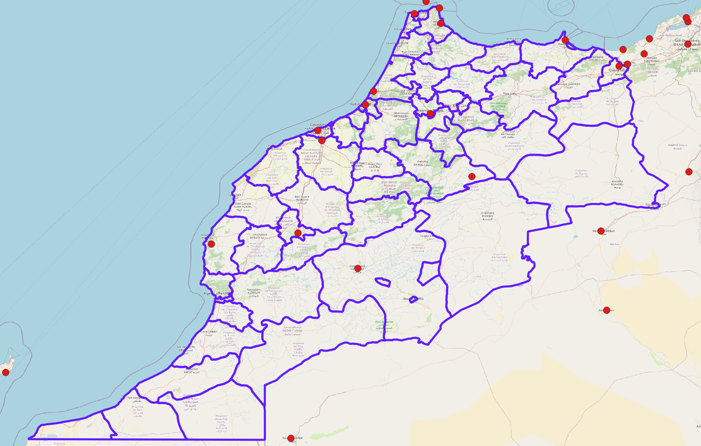
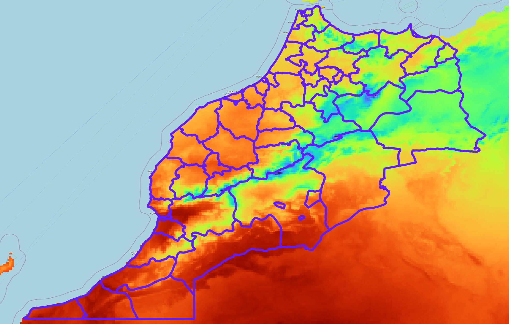
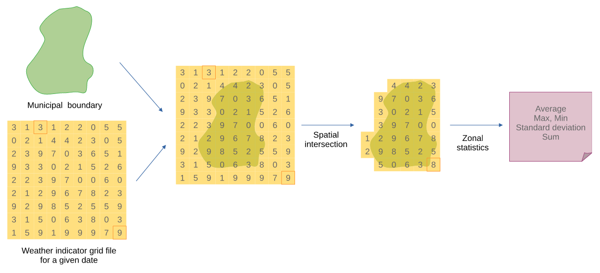

# Harmonização de indicadores

Estudos em Saúde Pública demandam uma grande quantidade de indicadores, provenientes de diversas áreas, para melhor refletir a realidade estudada, incluindo diversos aspectos contextuais sobre o processo saúde, doença e cuidado.

A diversidade de indicadores introduz um desafio extra: a necessidade de compatibilizar os indicadores de modo a permitir a sua observação e comparação simultânea.

Indicadores de saúde costumam ser agregados e divulgados por unidades administrativas ou sanitárias, como taxas de incidência de doenças por bairros, municípios ou regiões de saúde (dimensão espacial) e por dias, semanas epidemiológicas ou meses (dimensão temporal). Indicadores sociodemográficos seguem estruturas semelhantes.

Já indicadores ambientais e climáticos, como temperatura e precipitação, podem ser coletados em localizações específicas, como estações meteorológicas, constituindo observações dos fenômenos climáticos em um ponto no espaço, ou coletados por sensores remotos, como satélites e drones, apresentando uma superfície espacial de observações. Assim, para se incluir em uma mesma análise, indicadores de saúde e indicadores ambientais, se faz necessário realizar um procedimento para a *compatibilização das escalas espaciais e temporais* dos indicadores.

## Conceito

Entende-se aqui que a "harmonização de indicadores" é um processo de compatibilização, onde as escalas temporais e espaciais dos indicadores são trabalhadas de modo a serem analisadas de modo interoperável.

## Operacionalização

A operacionalização da harmonização de indicadores se dá através do re-cálculo dos indicadores para novas escalas espaciais e temporais, estabelecidas *a priori* considerando as necessidades do estudo. Ou seja, deve-se primeiro ponderar-se sobre qual a escala temporal e espacial adequada para o estudo e, em seguida, realizar os procedimentos de harmonização de acordo com as escalas definidas. 

Neste processo, indicadores de contagem podem ser somados ou divididos, mas indicadores como taxas e proporções devem ser recalculados.

::: {.callout-caution}
No caso de indicadores de taxas e proporções, não se deve aplicar estatísticas resumo, como média, mediada ou desvio padrão, para se obter o valor para a nova escala de análise. O indicador deve ser re-calculado inteiramente para a nova escala, considerando os novos valores de numerador e denominador adequados.
:::

### Dimensão temporal

A harmonização de indicadores na dimensão temporal se dá através da agregação ou desagregação do indicador para uma nova dimensão de tempo. Esta agregação/desagregação pode envolver a simples soma de valores no caso de indicadores de contagem, ou o re-cálculo do indicador considerando a nova escala temporal.

Por exemplo, se o indicador de saúde é uma contagem de casos por dia e se tem por objetivo da harmonização apresentar este indicador por semana epidemiológica, o procedimento será realizar a soma da quantidade de casos que ocorrem em uma mesma semana epidemiológica.

Contudo, se o indicador for uma taxa, ele deve ser recalculado considerando a contagem para a nova escala e o valor do denominador apropriado. 

### Dimensão espacial

A harmonização de indicadores na escala espacial deve considerar se o indicador é apresentado por pontos, por agregados em região administrativa, ou uma superfície espacial.

#### Pontos no espaço

Caso os valores do indicador sejam apresentados como pontos no espaço (exemplo, medidas de temperatura por estação meteorológica) os valores do indicador para cada ponto de mensuração devem ser agregados para a nova dimensão pretendida (como municípios ou alguma região administrativa).

A figura acima apresenta algumas estações meteorológicas localizadas no Marrocos e uma subdivisão administrativa do território. Em regiões com apenas uma estação, o valor desta estação é aplicado para toda a região. Em regiões com mais de uma estação, os valores das estações devem ser agregados e aplicados para a região. Regiões sem estações ficam sem valor para o indicador. 

:::{.callout-note}
Indicadores escalares como temperatura e umidade relativa do ar podem ser harmonizados utilizando-se a média estatística. Já a harmonização de indicadores de volume, como precipitação, costuma-se utilizar a soma.
:::

#### Regiões administrativas

Indicadores apresentados por regiões administrativas podem ser re-agregados para outras regiões administrativas caso exista uma hierarquia espacial compatível entre essas escalas. Por exemplo: municípios, microrregiões, macrorregiões, unidades federativas e grandes regiões. Neste caso, uma unidade espacial não pode estar contida em mais de uma outra unidade espacial de nível superior (por exemplo, um município não pode pertencer a duas ou mais UFs).

#### Superfície espacial

A harmonização de um indicador que é apresentado como uma superfície espacial é um caso especial de harmonização, onde é possível a aplicação de estatísticas resumo (como média, mediana e desvio-padrão). 

Neste caso de harmonização de indicadores, o indicador de superfície espacial deve ser, primeiramente, sobreposto espacialmente à malha dos limites administrativos, como apresentado na figura abaixo. 

Com esta sobreposição, observa-se quais *pixels* da superfície intersectam um elemento da malha. Considerando o conjunto de valores destes *pixels* que intersectam um dos elementos da malha, é aplicada uma estatística resumo, como a média. Este procedimento é denominado "estatística zonal" em *softwares* de geoprocessamento e Sistemas de Informação Geográfica (SIGs).

A harmonização constitui uma etapa fundamental no processo de compatibilização indicadores, garantindo que diferentes variáveis possam ser analisadas de forma integrada e coerente. Esse processo envolve o ajuste e a padronização dos indicadores para que estejam alinhados em termos de escala temporal e espacial, permitindo comparações e análises consistentes. Ao assegurar essa compatibilidade, a harmonização viabiliza a integração de múltiplas fontes de dados e amplia a capacidade de interpretar fenômenos complexos, especialmente em estudos que articulam diferentes dimensões, como os determinantes sociais, ambientais e de saúde.
